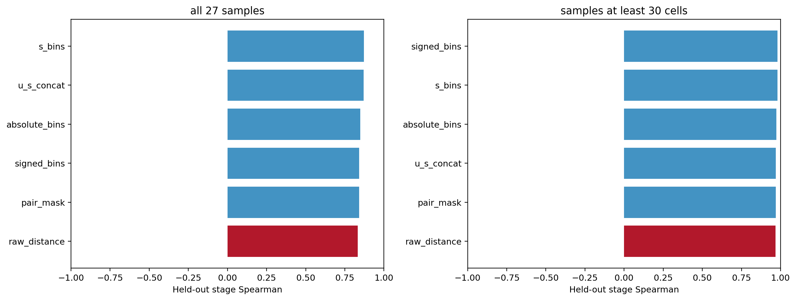

# Erythroid 27样本模块补证

主分析K=20；每个外层留一样本fold仅用其余26样本拟合逐基因标准化和基因MiniBatchKMeans；每样本取有效pair中位数，mask采用比例。基因要求训练细胞>=50观测且>=13训练样本有观测。样本缺失值只在模块模型内用训练均值补齐（z=0），未修改原矩阵；U/S拼接在同一个基因聚类中保留两个通道。模块均值经过RidgeCV（alpha=0.1/1/10/100，训练样本GCV）预测真实胚胎阶段。所有方法使用同一细胞及pair支持。

27样本主结果和>=30细胞样本的预测子集敏感性分别报告；后者不是重训删除小样本的协议。ARI比较不同leave-one-sample-out拟合与首fold的共同基因分组，属于算法稳定性，不是生物学真值。2000次配对sample bootstrap固定已有out-of-fold预测，不包含模型重训不确定性。既有moments预处理和预训练accession暴露未知，不能称为严格未见样本预训练泛化。未将神经模块基因移植到造血；此处独立验证模块分析流程。
